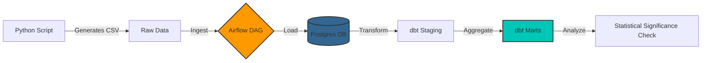

# 🧪 Automated A/B Testing Analytics Pipeline

An end-to-end **Data Engineering & Analytics** project that simulates, processes, and statistically analyzes A/B test data for an Ad-Tech use case.

Built using **Docker**, **Apache Airflow**, **dbt Core**, **PostgreSQL**, and **Python**.

---

## 📌 Project Overview

This project models a real-world A/B testing workflow commonly used by product, growth, and marketing analytics teams. It automates the entire experiment lifecycle — from raw event generation to statistical significance testing.

### The Scenario

A marketing team is testing a **new Ad Creative (Treatment)** against the **existing Ad (Control)**.

* **Objective:** Determine whether the new ad improves Click-Through Rate (CTR)
* **Scale:** 500,000+ synthetic user events
* **Outcome:** Automatically flags whether the observed uplift is statistically significant
  *(P-value < 0.05)*

---

## 🛠️ Tech Stack

| Layer          | Tools                         |
| -------------- | ----------------------------- |
| Orchestration  | Apache Airflow (Dockerized)   |
| Data Warehouse | PostgreSQL (Dockerized)       |
| Transformation | dbt Core                      |
| Analysis       | Python (NumPy, SciPy, Pandas) |
| Infrastructure | Docker Compose                |

---

## 🏗️ Architecture & Data Flow

The pipeline follows a modern ELT-based analytics architecture, orchestrated end-to-end using Airflow and dbt.



### Step-by-Step Flow

1. **Data Generation**

   * A Python script generates 500,000+ synthetic clickstream events
   * Conversion probabilities are controlled to simulate realistic A/B test behavior

2. **Ingestion (EL)**

   * Airflow orchestrates schema creation and raw CSV ingestion into Postgres
   * Designed to be idempotent and re-runnable

3. **Transformation (T)**

   * dbt staging models clean, type-cast, and validate raw data
   * dbt mart models aggregate metrics at the experiment group level

4. **Analysis**

   * Final Python script calculates conversion rates, Z-score, and P-value
   * Automatically determines whether the treatment outperformed the control

---

## 🚀 Running the Project Locally

### 1️⃣ Prerequisites

* Docker Desktop (running)
* Python 3.9+
* dbt CLI installed

---

### 2️⃣ Install Dependencies

```bash
pip install -r requirements.txt
```

---

### 3️⃣ Generate Synthetic Data

Create the raw dataset (500k rows):

```bash
python generate_data.py
```

This generates:

```
data/ad_clicks.csv
```

---

### 4️⃣ Start Infrastructure

Spin up Airflow and PostgreSQL:

```bash
docker-compose up -d
```

* **Airflow UI:** [http://localhost:8080](http://localhost:8080)

  * Username: `admin`
  * Password: `admin`

* **Postgres**

  * Host: `localhost`
  * Port: `5432`
  * User: `user`
  * Password: `password`
  * Database: `warehouse`

---

### 5️⃣ Ingest Data with Airflow

1. Open Airflow UI
2. Trigger DAG: `load_ad_data_v1`
3. Wait for successful completion (green)

---

### 6️⃣ Run dbt Transformations

```bash
# Validate connection
dbt debug

# Build models
dbt run

# Run data quality tests
dbt test
```

---

### 7️⃣ Run Statistical Significance Check

```bash
python check_significance.py
```

**Output includes:**

* Conversion rates by group
* Uplift percentage
* Z-score
* P-value
* Final experiment decision (Win / No Win)

---

## 📊 Key Concepts Demonstrated

| Concept                  | Description                                            |
| ------------------------ | ------------------------------------------------------ |
| Null Hypothesis (H₀)     | Assumes no difference between Control and Treatment    |
| Uplift                   | Difference in CTR between experiment groups            |
| P-value                  | Probability that observed uplift occurred by chance    |
| Statistical Significance | Decision threshold set at P < 0.05                     |
| Idempotency              | Pipeline can be safely re-run without duplicating data |

---

## 📂 Project Structure

```text
ab_project/
├── dags/
│   └── load_data.py            # Airflow EL pipeline
├── data/
│   └── ad_clicks.csv           # Generated raw data
├── models/
│   ├── staging/
│   │   └── stg_ad_clicks.sql   # Cleaning & casting
│   └── mart_ab_test.sql        # Aggregated experiment metrics
├── check_significance.py       # Statistical analysis
├── generate_data.py            # Synthetic data generator
├── docker-compose.yaml         # Infrastructure config
└── dbt_project.yml             # dbt configuration
```

---

## 📈 Future Improvements

* Add **Marketing Attribution modeling** for multi-touch analysis
* Integrate **Great Expectations** for advanced data quality checks
* Visualize results using **Metabase**, **Streamlit**, or **Superset**
* Parameterize experiment configuration for reusable testing pipelines

---

## 🎯 Why This Project?

This project demonstrates:

* Production-style data pipelines
* Analytics engineering best practices
* Applied statistics for decision-making
* Tooling commonly used in real data teams

It is designed to reflect how A/B testing analytics work **in practice**, not just theory.